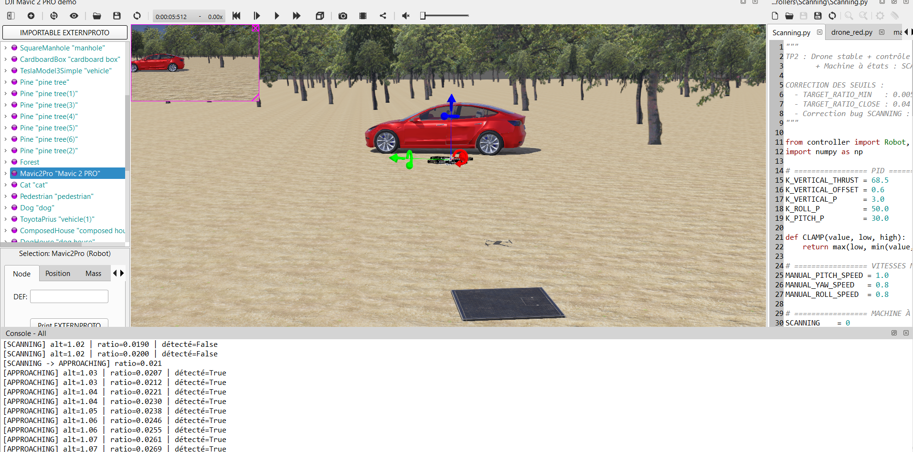

# 🛸 Autonomous Drone Red Object Tracking & Search - Webots

This project presents the simulation of an autonomous quadcopter drone (DJI Mavic 2 Pro) in **Webots**, capable of scanning an environment, detecting a red vehicle/object through image processing, and locking onto it in hover flight.

---

## 📷 Simulation Preview

---

## ⚙️ Architecture & Finite State Machine (FSM)

The Python controller (`Scanning.py`) implements a finite state machine for search and approach:

1. **`SCANNING`:** The drone rotates around its yaw axis to scan the environment.
2. **`APPROACHING`:** Triggered as soon as the red object exceeds the detection threshold (`ratio > 0.02`). The drone orients itself and moves toward the target (`pitch = -1.0`).
3. **`HOVERING`:** Triggered when the drone is close to the target (`ratio > 0.25`). It stabilizes in hover flight directly above the object.

> **Manual Mode:** A keyboard interrupt (arrow keys + SHIFT) allows manual intervention before switching back to automatic control.

---

## 🛠️ Technical Specifications

- **Simulator:** Webots (DJI Mavic 2 Pro drone)
- **Language & Libraries:** Python, NumPy, Webots API (`controller`)
- **Control:** P controllers for altitude hold (GPS) and Roll/Pitch attitude control (IMU & Gyroscope)
- **Image processing:** RGB camera with color-mask segmentation and centroid computation `(cx, cy)`

---

## 📂 Repository Organization

- **`/controllers/Scanning/`**: Python controller source code (`Scanning.py`).
- **`/worlds/`**: Webots simulation scene (`drone_red_object_search.wbt`).
- **`/Images/`**: Screenshots and simulation renders.
